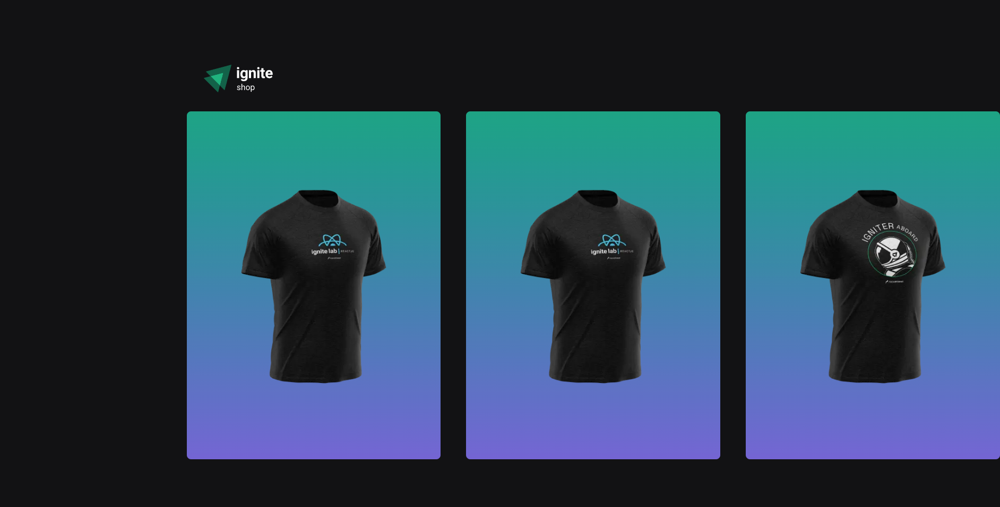
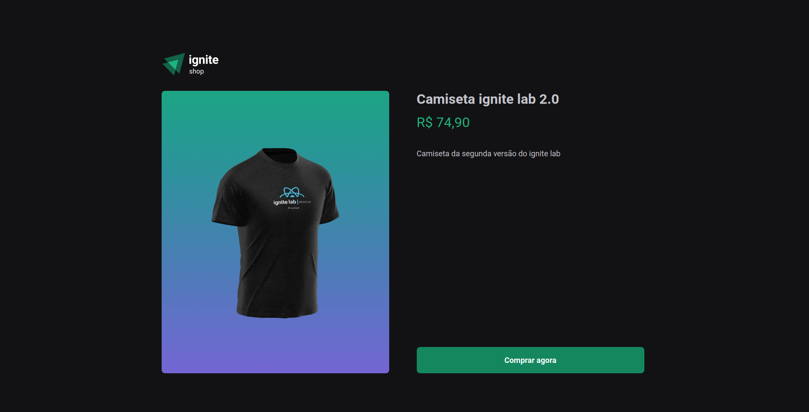

<h1 align="center">
  
</h1>

<h3 align="center">
  Ignite Shop
</h3>

<p align="center">Best clothes in one place</p>

<p align="center">
  <a href="#-about-the-project">About the project</a>&nbsp;&nbsp;&nbsp;|&nbsp;&nbsp;&nbsp;
  <a href="#-technologies">Technologies</a>&nbsp;&nbsp;&nbsp;|&nbsp;&nbsp;&nbsp;
  <a href="#-getting-started">Getting started</a>&nbsp;&nbsp;&nbsp;|&nbsp;&nbsp;&nbsp;
  <a href="#-license">License</a>
</p>

## 👨🏻‍💻 About the project

- <p style="color: red;">Ignite Shop website</p>




## 🚀 Technologies

Technologies that I used to develop this web client

- [NextJS](https://nextjs.org)
- [TypeScript](https://www.typescriptlang.org/)
- [Stripe](https://stripe.com/en-br)

## 💻 Getting started

### Requirements

**Clone the project and access the folder**

```bash
$ git clone https://github.com/joao-garcia404/ignite-shop && cd ignite-shop
```

**Follow the steps below**

```bash
# Install the dependencies
$ yarn

# Start the client
$ yarn dev
```

## 📝 License

This project is licensed under the MIT License - see the [LICENSE](LICENSE) file for details.

---

Made with 💜 &nbsp;by João Vitor Garcia 👋 &nbsp;[See my linkedin](https://www.linkedin.com/in/joao-garcia404/)
